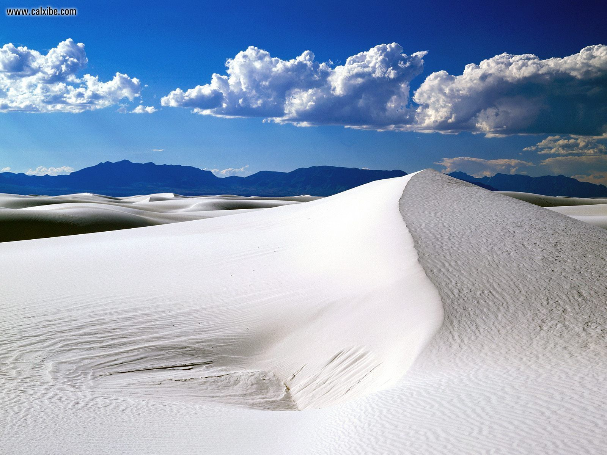
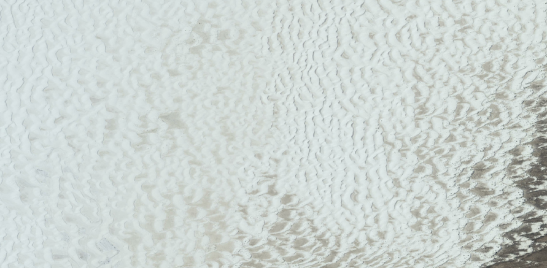
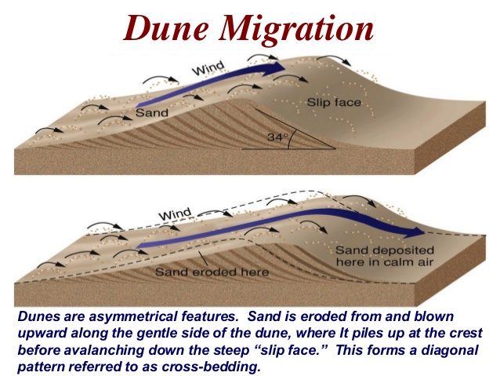
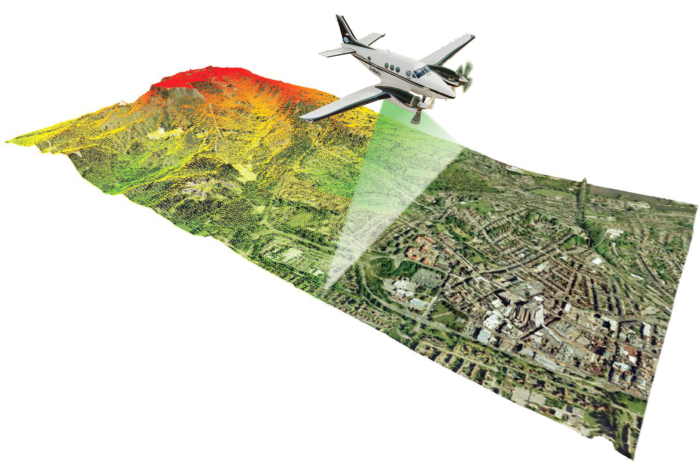
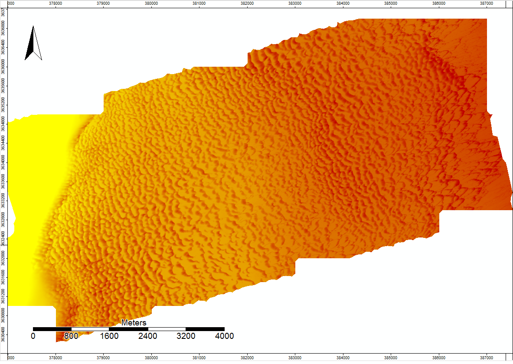
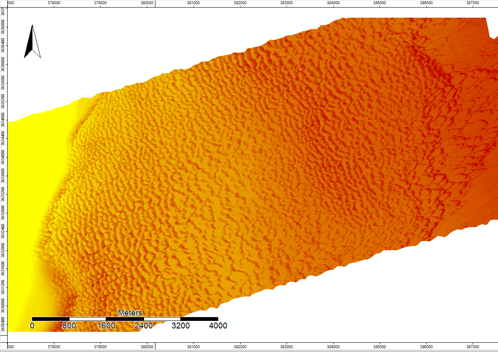
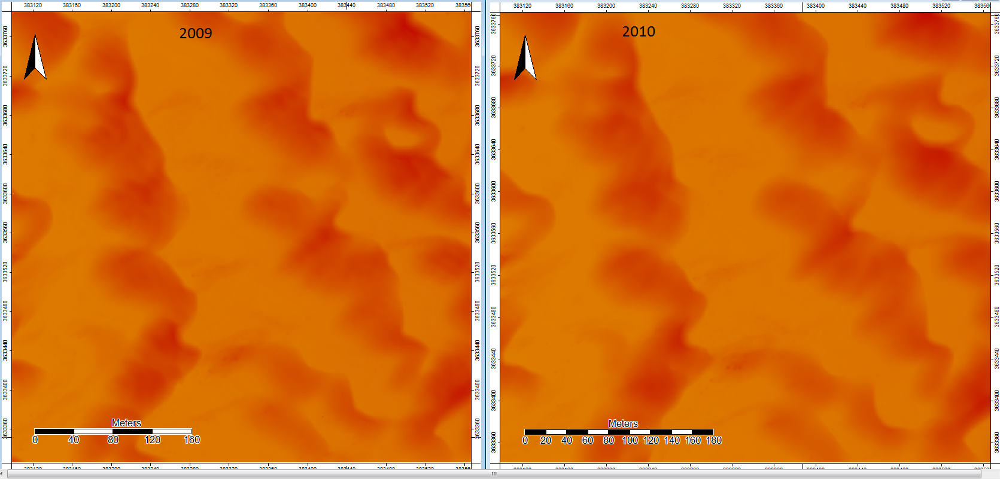
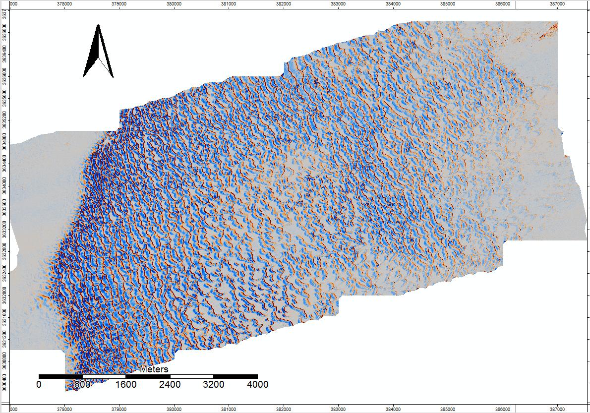

## White Sands National Monument, New Mexico
The White Sands National Monument contains the world's largest gypsum dune field with an area of 710 square kilometers. Gypsum is rarely found in the form of sand and is most commonly used to make drywall. The dunes are known to be constantly changing in shape and location.  The purpose of this web page is to explain how we can tell how the dunes are changing.

From the Ground

From the Sky

From a Microscope

## How Do Dunes Migrate?

more on Dune Migration [link](Geology of Sand Dunes.pdf)

## How do we map dune fields?
This is done through gathering LiDAR data. LiDAR, or LIght Detection And Ranging, is a method of surveying large areas of terrain by shooting laser beams usually out of an airplane at the surface of the Earth.  The laser beams return to the plane after they come into contact with something and they calculate elevation and classification of the terrain.

## The Dunes
Lidar data acquisition and processing completed by the National Center for Airborne Laser Mapping (NCALM - http://www.ncalm.org). NCALM funding provided by NSF's Division of Earth Sciences, Instrumentation and Facilities Program. EAR-1043051.
https://doi.org/10.5069/G9Q23X5P (January 2009). https://doi.org/10.5069/G97D2S2D (June 2010).

Here are Digital elevation models created from the two different LiDAR data sets.  Yellow is lower elevation and red is higher elevation. 
January 2009

June 2010

Zoomed out this far the two models don't appear to be too different, but when you look closer the differences become more apparent.

Even then the differences are subtle.  To make these differences more apparent the 2010 model was subtracted from the 2009 model to show all of the spots where the elevation differed between the two different elevation models.

