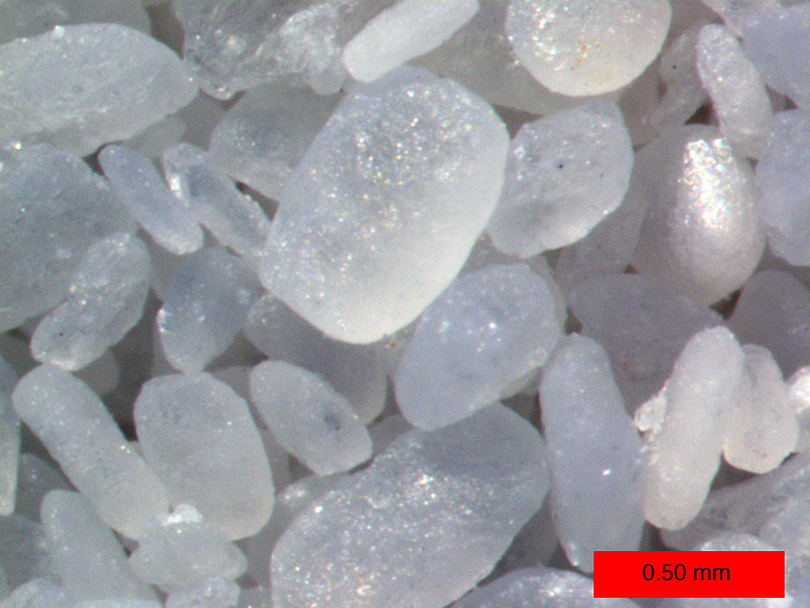

## White Sands National Monument, New Mexico
The White Sands National Monument contains the world's largest gypsum dune field with an area of 710 square kilometers. Gypsum is rarely found in the form of sand and is most commonly used to make drywall.

From the Ground

From the Sky

From a Microscope

## How Do Dunes Migrate?

## How do we map dune fields?
This is done through gathering LiDAR data. LiDAR, or LIght Detection And Ranging, is a method of surveying large areas of terrain by bouncing laser beams off of the surface of an area.

